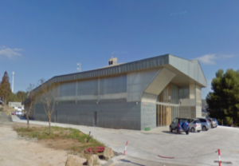

&nbsp;&nbsp;&nbsp;&nbsp;&nbsp;&nbsp;

# Trabajos Fin de Máster - Curso 2023 / 2024

En este repositorio se encuentra centralizada toda la información relativa a los **Trabajos Fin de Máster del Curso de Especialización en Inteligencia Artificial y Big Data del CPIFP Alan Turing**, en la convocatoria del curso 2023 / 2024.

## Índice

* [Relación de Trabajos Fin de Máster](#id1)
* [Requisitos y criterios](#id2)
* [Código y documentación a entregar](#id3)
* [Fechas a tener en cuenta](#id4)
* [Cuadrante horario de las exposiciones](#id5)
* [Lugar de las exposiciones](#id6)
* [Evaluación del TFM](#id7)

## Relación de Trabajos Fin de Máster

Cada grupo debe cumplimentar la siguiente tabla:

| Grupo | Primer integrante   | Segundo integrante  | Tercer integrante  | Título del TFM | Enlace al repositorio |
|:-----:|:-------------------:|:-------------------:|:------------------:|:--------------:|:---------------------:|
|   1   |                     |                     |                    |                |                       |
|   2   |                     |                     |                    |                |                       |
|   3   |                     |                     |                    |                |                       |
|   4   |                     |                     |                    |                |                       |
|   5   |                     |                     |                    |                |                       |
|   6   |                     |                     |                    |                |                       |
|   7   |                     |                     |                    |                |                       |

## Requisitos y criterios

## Código y documentación a entregar

## 🗓️ Fechas a tener en cuenta

## ⏰ Cuadrante horario de las exposiciones

## 📍 Lugar de las exposiciones

Las exposiciones tendrán lugar en [C/ Frederick Terman,3. 29590, PTA](https://goo.gl/maps/NUnpUFXAWocgUKxv9).

## 📝 Evaluación del TFM
